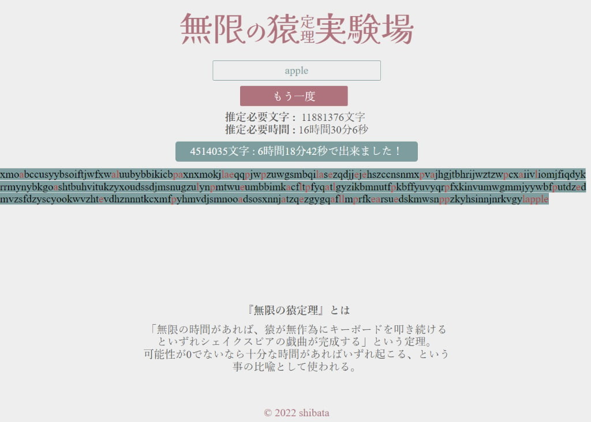

# 無限の猿実験場

[無限の猿実験場](https://shibawanko0202.github.io/monkeybord/)←play!

「無限の猿定理」の実証実験用webアプリです。

### 無限の猿定理とは
無限の時間があり、猿が無作為にキーボードを叩き続けるといずれ意味のある文章が完成するという定理。

・半角英字のみ入力できます。

・半角英字26字からランダムにキーが入力されます。

